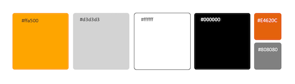
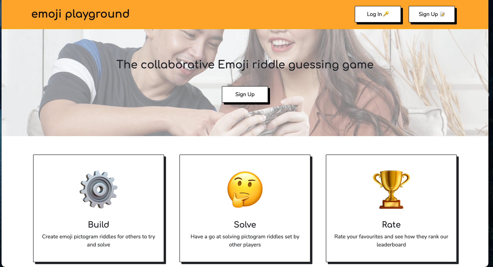
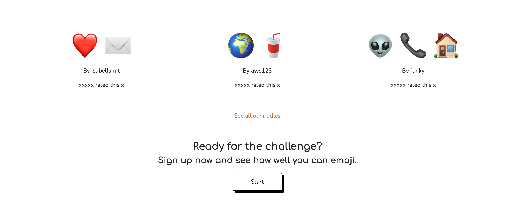
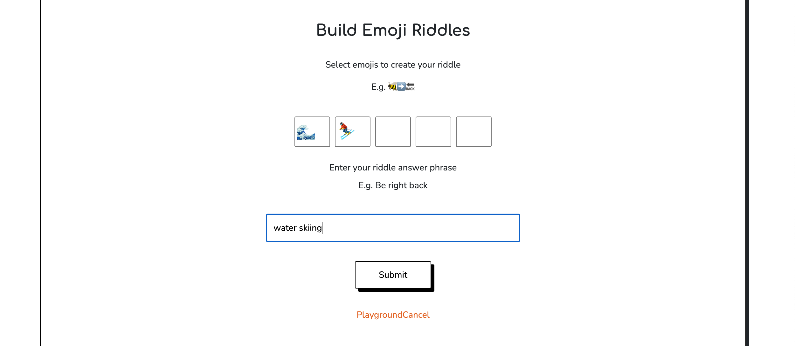
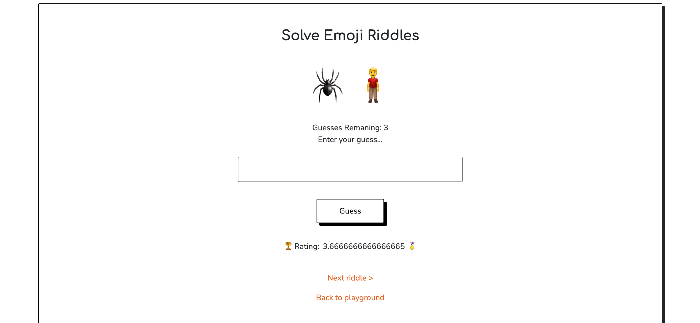
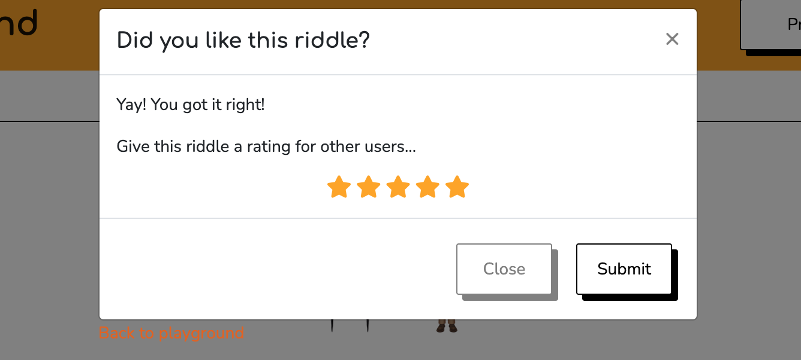

<h1 align="center">Emoji Playground</h1>

This app Emoji Playground is a fun and creative app where users can try to solve pictogram riddles that other users have submitted, as well as start creating their own riddles so others can have a go at solving  them. In addition users can also rate the ones they find the best ones and the website will display a leaderboard of the most popular ones chosen by the users. In order to participate the users have to setup an account and login to the app.

[View the live website here.](https://emojiplayground.herokuapp.com/)

## User Experience (UX)

-   ### User stories

    -   #### First Time Visitor Goals
        As a first time visitor I expect 
      
    -   #### Returning Visitor Goals
        As a returning user I expect 

        

    -   #### Frequent User Goals
        As frequent user I expect 

        

-   ### Design
    -   #### Color Scheme
        A simple colour palette of black, white, and grey has been used with highlighting tones of orange. This adds a vibrant and playful look to the website. The footer and nav bar colours are different to the main website background, so to distinguish them from the main body of the page. A slightly darker tone of orange has been used on links for a better colour contrast rating.

        

    -   #### Typography  
        Headings are in Comfortaa and normal text is in Nunito. Comfortaa is a rounded and slightly cursive font. It is playful and adds personality to the website, while remaining easily readable. Nunito is a well-balanced, highly readable sans-serif font frequently used for websites and applications.    
        
        Fallback fonts of Verdana and sans-serif have been used in case the fonts cannot be imported into the site correctly. The website name in the Nav Bar is in lower-case, to enhance the playful nature of the font. Normal capitalization has been used elsewhere on the site for enhanced readability.

    -   #### Imagery & Icons
        The website uses emojis throughout. This makes the website look and feel consistent. It also demonstrates to the user how emojis can be used interchangeably with words, which is a key element of gameplay. The jumbotron features an image of two people looking and smiling at their phones. This highlights the fun, peer to peer aspect of the game. 
        
   

## Existing Features

- ### Nav and Jumbotron
    - In the top of the landing page there is a navigation bar and information section about what the website is all about, displayed clearly to the users upon entering the site. Just enough of the necessary details to get started is shown in order to prevent information overload.    
     
    

- ### The Leaderboard
    -    In the leaderboard section the highest ranked riddles are shown in order to inspire and motivate the user to create and submit their best riddles.  

    

- ### The Playground
    -   The Playground section allows for playfulness when letting users be creative and start combining their own riddles using the provided emoji picker.  

    

- ### Solve Others Riddles
    -   This area is where the user will be challenged by riddles that has been submitted by other users. 
    

- ### Rate the Riddle
    -   After trying to solve the riddles, users are able to give each riddle a star rating from 1-5. The highest ranked riddles will be shown on the leaderboard.
    

## Technologies Used

### Languages Used
 - [HTML5](https://en.wikipedia.org/wiki/HTML5)
 - [CSS3](https://en.wikipedia.org/wiki/Cascading_Style_Sheets)
 - [Javascript](https://en.wikipedia.org/wiki/JavaScript)
 - [Python](https://en.wikipedia.org/wiki/Python_(programming_language))

### Frameworks, Libraries & Programs Used
 - [Google Fonts:](https://fonts.google.com/)
    - Used for all fonts throughout the website by import to the style.css file. 
 - [Font Awesome:](https://fontawesome.com/)
    - Is used for the social media icons in the footer on all pages. 
 - [Git](https://git-scm.com/)
    - Git was used for version control through the Gitpod terminal to commit and push to GitHub
 - [GitHub:](https://github.com/)
     - Was used for all storing and backup of the code pertaining to the project. 
 - [Bootstrap:](https://getbootstrap.com/)
     - Was used as a framework for the front end design and layout. 
 - [MongoDB:](https://www.mongodb.com/)
     - Was used for the database program. 
 - [Flask:](https://flask.palletsprojects.com/en/2.1.x/)
     - Was used as a framework for the backend integration.

## Testing
-   [W3C Markup Validator](https://validator.w3.org/nu/) 

-   [W3C CSS Validator](https://jigsaw.w3.org/css-validator/#validate_by_input) 
    

### Testing User Stories from User Experience (UX) Section

-   #### First Time Visitor Goals
    -   As a first time visitor I expect 

    -   As a first time visitor I expect 

    -   As a first time visitor I want to 

-   #### Returning Visitor Goals
    - As a returning user I expect to be able to 

    - As a returning visitor interested in 

    

-   #### Frequent User Goals
    - As frequent user I expect to

### Further Testing
-   

### Known Bugs
|Bug | Solution | Status |
|----|:---------|:-------|
|| |  |

## Deployment

### Forking the GitHub Repository
1. Go to [the project repository](https://github.com/ErikHgm/Tesla-Order-App)
2. In the right most top menu, click the "Fork" button.
3. There will now be a copy of the repository in your own GitHub account.

### Running the project locally
1. Go to [the project repository](https://github.com/ErikHgm/Tesla-Order-App)
2. Click on the "Code" button.
3. Choose one of the three options (HTTPS, SSH or GitHub CLI) and then click copy.
4. Open the terminal in you IDE program. 
5. Type `git clone` and paste the URL that was copied in step 3.
6. Press Enter and the local clone will be created. 

### Alternatively by using Gitpod:
1. Go to [the project repository](https://github.com/ErikHgm/Tesla-Order-App)
2. Click the green button that says "Gitpod" and the project will now open up in Gitpod.

### Creating an Application with Heroku

I followed the below steps using the Code Institute tutorial:

The following command in the Gitpod CLI will create the relevant files needed for Heroku to install your project dependencies `pip3 freeze --local > requirements.txt`. Please note this file should be added to a .gitignore file to prevent the file from being committed.

1. Go to [Heroku.com](https://dashboard.heroku.com/apps) and log in; if you do not already have an account then you will need to create one.
2. Click the `New` dropdown and select `Create New App`.
3. Enter a name for your new project, all Heroku apps need to have a unique name, you will be prompted if you need to change it.
4. Select the region you are working in.

#### Heroku Settings  
You will need to set your Environment Variables - this is a key step to ensuring your application is deployed properly.
1. In the Settings tab, click on `Reveal Config Vars` and set the following variables:
    - If using credentials you will need to add the credentials as a variable, the key is the name 'CREDS' and the value is the contents of your creds JSON
    - Add key: `PORT` & value `8000`
2. Buildpacks are also required for proper deployment, simply click `Add buildpack` and search for the ones that you require.
    - For this project, I needed to add `Python` and `Node.js`, in this order.

####  Heroku Deployment  
In the Deploy tab:
1. Connect your Heroku account to your Github Repository following these steps:
    - Click on the `Deploy` tab and choose `Github-Connect to Github`.
    - Enter the GitHub repository name and click on `Search`.
    - Choose the correct repository for your application and click on `Connect`.
2. You can then choose to deploy the project manually or automatically, automatic deployment will generate a new application every time you push a change to Github, whereas manual deployment requires you to push the `Deploy Branch` button whenever you want a change made.
3. Once you have chosen your deployment method and have clicked `Deploy Branch` your application will be built and you should now see the `View` button, click this to open your application.

## Credits

### Media
- The hero image comes from Afif Kusuma via Unsplash.

