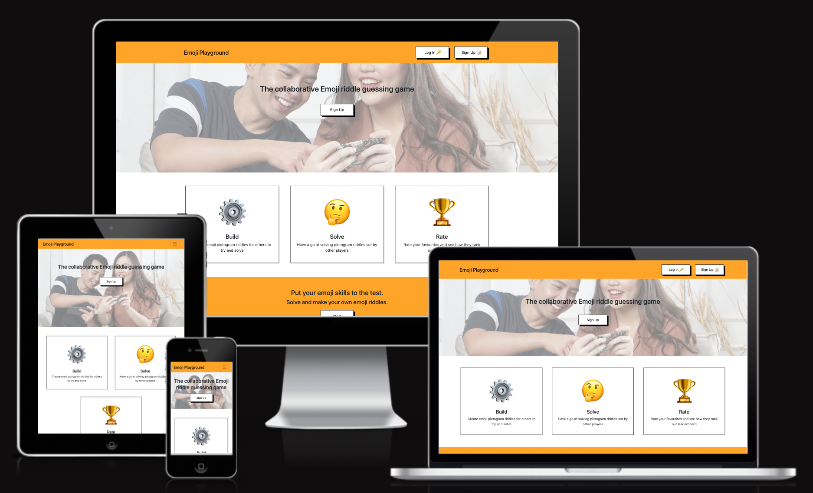

<h1 align="center">Emoji Playground</h1>

This app Emoji Playground is a fun and creative app where users can try to solve pictogram riddles that other users have submitted, as well as start creating their own riddles so others can have a go at solving  them. In addition users can also rate the ones they find the best ones and the website will display a leaderboard of the most popular ones chosen by the users. In order to participate the users have to setup an account and login to the app.

[View the live website here.](https://emojiplayground.herokuapp.com/)

## User Experience (UX)

-   ### User stories

    -   #### First Time Visitor Goals
        As a first time visitor I expect 
      
    -   #### Returning Visitor Goals
        As a returning user I expect 

        

    -   #### Frequent User Goals
        As frequent user I expect 

        

-   ### Design
    - Color Scheme  
    

    - Typography  

       
    - Imagery  
        
   

## Existing Features

- ### Header and Navigation Bar
    - 

- ### Landing page 

    

- ### The Footer
    - 

## Technologies Used

### Languages Used
 - [HTML5](https://en.wikipedia.org/wiki/HTML5)
 - [CSS3](https://en.wikipedia.org/wiki/Cascading_Style_Sheets)
 - [Javascript](https://en.wikipedia.org/wiki/JavaScript)
 - [Python](https://en.wikipedia.org/wiki/Python_(programming_language))

### Frameworks, Libraries & Programs Used
 - [Font Awesome:](https://fontawesome.com/)
    - Is used for the social media icons in the footer on all pages. 
 - [Git](https://git-scm.com/)
    - Git was used for version control through the Gitpod terminal to commit and push to GitHub
 - [GitHub:](https://github.com/)
     - Was used for all storing and backup of the code pertaining to the project. 
 - [Bootstrap:](https://getbootstrap.com/)
     - Was used as a framework for the fron end design and layout. 
 - [MongoDB:](https://www.mongodb.com/)
     - Was used for the database program. 
 - [Flask:](https://flask.palletsprojects.com/en/2.1.x/)
     - Was used as a framework for the backend integration.

## Testing
-   [W3C Markup Validator](https://jigsaw.w3.org/css-validator/#validate_by_input) 
    - 

-   [W3C CSS Validator](https://jigsaw.w3.org/css-validator/#validate_by_input) 
    - 

### Testing User Stories from User Experience (UX) Section

-   #### First Time Visitor Goals
    -   As a first time visitor I expect 

    -   As a first time visitor I expect 

    -   As a first time visitor I want to 

-   #### Returning Visitor Goals
    - As a returning user I expect to be able to 

    - As a returning visitor interested in 

    

-   #### Frequent User Goals
    - As frequent user I expect to

### Further Testing
-   

### Known Bugs
|Bug | Solution | Status |
|----|:---------|:-------|
|| |  |

## Deployment

## Credits

### Code
- 

### Content
- 

### Media
- 

### Acknowledgements
- 

