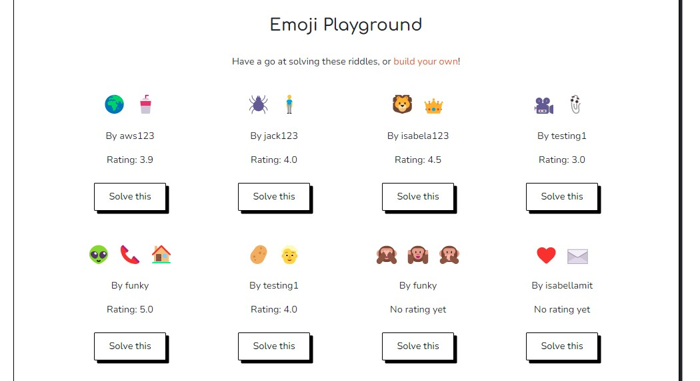
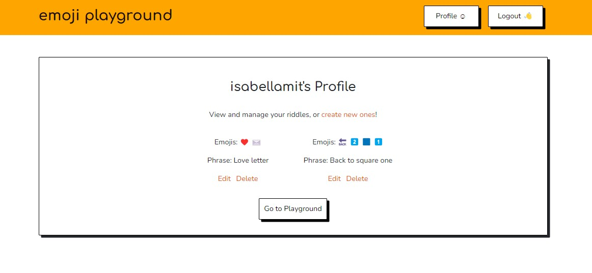

<h1 align="center">Emoji Playground</h1>

This app Emoji Playground is a fun and creative app where users can try to solve pictogram riddles that other users have submitted, as well as start creating their own riddles so others can have a go at solving  them. In addition users can also rate the ones they find the best ones and the website will display these ratings to other users. In order to participate the users have to setup an account and login to the app.

[View the live website here.](https://emojiplayground.herokuapp.com/)

## Table of Contents  

### Contents
- [User Experience (UX)](#user-experience-ux)
  * [User Stories](#user-stories)
    + [First Time Visitor Goals](#first-time-user-goals)
    + [Returning Visitor Goals](#returning-visitor-goals)
    + [Frequent User Goals](#frequent-user-goals)
- [Design](#design)
  + [Colour Scheme](#colour-scheme)
  + [Typography](#typography)
  + [Imagery & Icons](#imagery-icons)
- [Wireframes](#wireframes)
- [Exsisting Features](#features)
  + [Nav and Jumbotron](#nav-and-jumbotron)
  + [The Playground](#the-playground)
  + [Build Your Own Riddle](#build-your-own-riddle)
  + [Solve Other Riddles](#solve-other-riddles)
  + [Rate the Riddle](#rate-the-riddle)
  + [Profile](#profile)
- [Future Features](#future-features)
- [Technologies used](#technologies-used)
  + [Languages Used](#languages-used)
  + [Frameworks Libraries and Programs Used](#frameworks-libraries-and-programs-used)
- [Testing](#testing)
  + [Testing User Stories from User Experience (UX) Section](#testing-user-stories-from-user-experience-ux-section)
- [Known Bugs](#known-bugs)
- [Deployment](#deployment)
- [Credits](#credits)
  + [Collaborators](#collaborators)
  + [Code](#code)
  + [Media](#media)
  + [Acknowledgements](#acknowledgements)

## User Experience (UX)

-   ### User stories

    -   #### First Time Visitor Goals
  
        As a first time visitor I expect to quickly find clear and concise information about what the website is all about and how to use it.

        As a first time user I expect to be able to create my user account in order to both start creating and solving riddles.
      
    -   #### Returning Visitor Goals
        As a returning user I expect to be able to create and submit more riddles to the service.

        As a returning user I expect to be able to solve more riddles that others have submitted to the service.
        
    -   #### Frequent User Goals
        As frequent user I expect that others have rated my riddles.

        As frequent user I expect to create riddles that gets better ratings.

        

-   ### Design
    -   #### Color Scheme
        A simple colour palette of black, white, and grey has been used with highlighting tones of orange. This adds a vibrant and playful look to the website. The footer and nav bar colours are different to the main website background, so to distinguish them from the main body of the page. A slightly darker tone of orange has been used on links for a better colour contrast rating.

        

    -   #### Typography  
        Headings are in Comfortaa and normal text is in Nunito. Comfortaa is a rounded and slightly cursive font. It is playful and adds personality to the website, while remaining easily readable. Nunito is a well-balanced, highly readable sans-serif font frequently used for websites and applications.    
        
        Fallback fonts of Verdana and sans-serif have been used in case the fonts cannot be imported into the site correctly. The website name in the Nav Bar is in lower-case, to enhance the playful nature of the font. Normal capitalization has been used elsewhere on the site for enhanced readability.

    -   #### Imagery & Icons
        The website uses emojis throughout. This makes the website look and feel consistent. It also demonstrates to the user how emojis can be used interchangeably with words, which is a key element of gameplay. The jumbotron features an image of two people looking and smiling at their phones. This highlights the fun, peer to peer aspect of the game. 

## Wireframes
- [View the project wireframes here](static/wireframes/wireframes.pdf).

## Existing Features

- ### Nav and Jumbotron
    - In the top of the landing page there is a navigation bar and information section about what the website is all about, displayed clearly to the users upon entering the site. Just enough of the necessary details to get started is shown in order to prevent information overload.  
      
      

- ### The Playground
    -    In the playground section the emoji riddles are shown with their ratings in order to inspire and motivate the user to create and submit their best riddles.
      
          

- ### Build Your Own Riddle
    -   The Build Your Own Riddle section allows for playfulness when letting users be creative and start combining their own riddles using the provided emoji picker.  

          

- ### Solve Others Riddles
    -   This area is where the user will be challenged by riddles that has been submitted by other users. 
    - How it works:
        - Each of the answer words are compared to the guess words and broken down into matched and unmatched.
        - 90% of the total words (matched and unmatched for both guess and answer words) must be correct for the guess to be marked as correct
        - This prevents the user from getting the answer right by just entering hundreds of words
        - Different messages appear depending on what percentage of words the user got correct. Eg. If the user gets 75% of the words correct the application instructs them that they are almost correct (“just a little tweak”)
        - For the answer to be correct the user must also get more than half the words in the answer correct.
          
          

- ### Rate the Riddle
    -   After trying to solve the riddles, users are able to give each riddle a star rating from 1-5. The highest ranked riddles will be shown on the Playground.
          
          

- ### Profile
    -   Users can see Riddles they've created in their profile. They also have the option to edit and delete their riddles.
    - The application has full CRUD functionality, meaning the user can delete (click) or edit (click) their riddles.
          
        

## Future Features

- ### Pagination on Playground page
    - Pagination on the playground would be better suited to handling a large number of emoji riddles.

- ### Make flash messages into a pop-up/ modal
    - Further styling to the logged in/ logged out alerts would be more aesthetically pleasing and present a better user experience.

- ### Marking solved puzzles as complete
    - At present the player can replay riddles if they choose to. By adding something that marks a riddle as played, the user would know they have already completed it. It would be clearer to them what riddles are new or they have not completed yet

- ### Further animations and music for correct answers
    - Further sensory alerts to accompagny the congratulations message would further emphasis success to the player.

- ### A Leaderboard
    - A leaderboard would make it easy to see which emoji riddles people have played and rate the most. It could feature 'All Time' and 'Most Recent' categories.

## Technologies Used

### Languages Used
 - [HTML5](https://en.wikipedia.org/wiki/HTML5)
 - [CSS3](https://en.wikipedia.org/wiki/Cascading_Style_Sheets)
 - [Javascript](https://en.wikipedia.org/wiki/JavaScript)
 - [Python](https://en.wikipedia.org/wiki/Python_(programming_language))

### Frameworks, Libraries & Programs Used
 - [Google Fonts:](https://fonts.google.com/)
    - Used for all fonts throughout the website by import to the style.css file. 
 - [Font Awesome:](https://fontawesome.com/)
    - Is used for the social media icons in the footer on all pages. 
 - [Git](https://git-scm.com/)
    - Git was used for version control through the Gitpod terminal to commit and push to GitHub
 - [GitHub:](https://github.com/)
     - Was used for all storing and backup of the code pertaining to the project. 
 - [GitHub Projects](https://github.com/)
     - Was used for managing tasks of the project
 - [Bootstrap:](https://getbootstrap.com/)
     - Was used as a framework for the front end design and layout. 
 - [MongoDB:](https://www.mongodb.com/)
     - Was used for the database program. 
 - [Flask:](https://flask.palletsprojects.com/en/2.1.x/)
     - Was used as a framework for the backend integration.
- [Vanilla emoji picker](https://github.com/woody180/vanilla-javascript-emoji-picker)
    - The emoji picker is an external library integrated into this project.

## Testing
-   [W3C Markup Validator](https://validator.w3.org/nu/) 

-   [W3C CSS Validator](https://jigsaw.w3.org/css-validator/#validate_by_input) 
    

### Testing User Stories from User Experience (UX) Section

-   #### First Time Visitor Goals
    As a first time visitor I expect to quickly find clear and concise information about what the website is all about and how to use it.  
    -   Upon entering the website, users are immediately greeted and guided with the necessary information that quickly allows the user to get started and a call to action to sign up to the service in order to participate.  

    As a first time user I expect to be able to create my user account in order to both start creating and solving riddles.
    - The user accounts buttons are located at the top in the nav bar to be able to be easly found by the users.  
      
-   #### Returning Visitor Goals
    As a returning user I expect to be able to create and submit more riddles to the service.
    -   As a returning visitor the user will be able to login again to their account and continue to add riddles to their profile.

    As a returning user I expect to be able to solve more riddles that others have submitted to the service.
    -   After learning how the website works and trying to solve riddles, the users will quickly learn how the riddles works and be able to improve their skills.
        
-   #### Frequent User Goals
    As frequent user I expect that others have rated my riddles.
    -   As a frequent user you will have submitted many riddles and the likelihood of someone rating them will have increased.

    As frequent user I expect to create riddles that gets better ratings. I can see their rankings on the playground.
    -   After submitting several riddles and receiving ratings, the user will be able to improve on their riddle creating skills by learning which ones that gets the best ratings.

### Further Testing
-   Different browsers including Google Chrome, Internet Explorer, Safar and Microsoft Edge has been used on order to test and confirm the compatibility of the website.
-   In order to make sure all the links and navigation works properly, proper testing was done to confirm functionality.
-   Correct scaling on different devices was tested using the tool below:
    -   [Responsivetesttool](http://responsivetesttool.com/)

### Known Bugs
|Bug | Solution | Status |
|----|:---------|:-------|

|The "Next Riddle" button in playground did not work properly|Updated the related function |Fixed  |

## Deployment

### Forking the GitHub Repository
1. Go to [the project repository](https://github.com/ErikHgm/Tesla-Order-App)
2. In the right most top menu, click the "Fork" button.
3. There will now be a copy of the repository in your own GitHub account.

### Running the project locally
1. Go to [the project repository](https://github.com/ErikHgm/Tesla-Order-App)
2. Click on the "Code" button.
3. Choose one of the three options (HTTPS, SSH or GitHub CLI) and then click copy.
4. Open the terminal in you IDE program. 
5. Type `git clone` and paste the URL that was copied in step 3.
6. Press Enter and the local clone will be created. 

### Alternatively by using Gitpod:
1. Go to [the project repository](https://github.com/ErikHgm/Tesla-Order-App)
2. Click the green button that says "Gitpod" and the project will now open up in Gitpod.

### Creating an Application with Heroku

I followed the below steps using the Code Institute tutorial:

The following command in the Gitpod CLI will create the relevant files needed for Heroku to install your project dependencies `pip3 freeze --local > requirements.txt`. Please note this file should be added to a .gitignore file to prevent the file from being committed.

1. Go to [Heroku.com](https://dashboard.heroku.com/apps) and log in; if you do not already have an account then you will need to create one.
2. Click the `New` dropdown and select `Create New App`.
3. Enter a name for your new project, all Heroku apps need to have a unique name, you will be prompted if you need to change it.
4. Select the region you are working in.

#### Heroku Settings  
You will need to set your Environment Variables - this is a key step to ensuring your application is deployed properly.
1. In the Settings tab, click on `Reveal Config Vars` and set the following variables:
    - If using credentials you will need to add the credentials as a variable, the key is the name 'CREDS' and the value is the contents of your creds JSON
    - Add key: `PORT` & value `8000`
2. Buildpacks are also required for proper deployment, simply click `Add buildpack` and search for the ones that you require.
    - For this project, I needed to add `Python` and `Node.js`, in this order.

####  Heroku Deployment  
In the Deploy tab:
1. Connect your Heroku account to your Github Repository following these steps:
    - Click on the `Deploy` tab and choose `Github-Connect to Github`.
    - Enter the GitHub repository name and click on `Search`.
    - Choose the correct repository for your application and click on `Connect`.
2. You can then choose to deploy the project manually or automatically, automatic deployment will generate a new application every time you push a change to Github, whereas manual deployment requires you to push the `Deploy Branch` button whenever you want a change made.
3. Once you have chosen your deployment method and have clicked `Deploy Branch` your application will be built and you should now see the `View` button, click this to open your application.

## Credits

### Collaborators
- This project was created by:

    - Aws Sabah Gheni - [GitHub](https://github.com/AwsSG)
    - Jack O'Sullivan - [GitHub](https://github.com/j-j-jack)
    - Isabella Mitchell - [GitHub](https://github.com/Isabella-Mitchell)
    - Erik Hagman - [GitHub](https://github.com/ErikHgm)
    - With contribution from Emelie Markkanen Åberg in the planning session.

### Code
- Bootstrap classes were used in this project for festures including layout, navigation, buttons.
- Code Institute's Gitpod full template was used for this project.

### Media
- The hero image comes from Afif Kusuma via Unsplash.

### Acknowledgements
- Thank you to Code Institute for organising this Hackathon! 

